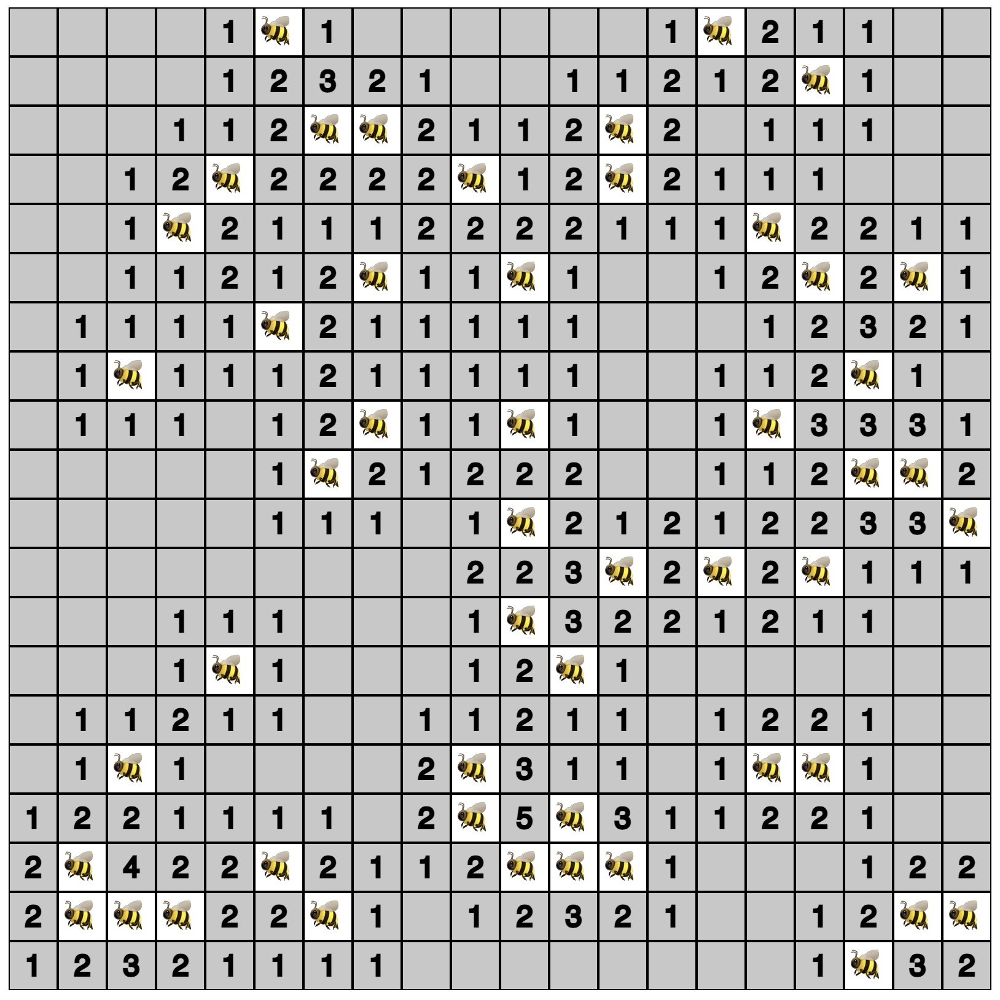

# Beesweeper

Basic variation of minesweeper game with [P5.js](https://p5js.org/)
This code is modified version of [the tutorial on Coding Traing channel on Youtube](https://youtu.be/LFU5ZlrR21E)

To run the project in development mode, just `npm install` and `npm run dev`. It will start a `live-server` on available port on your computer.

